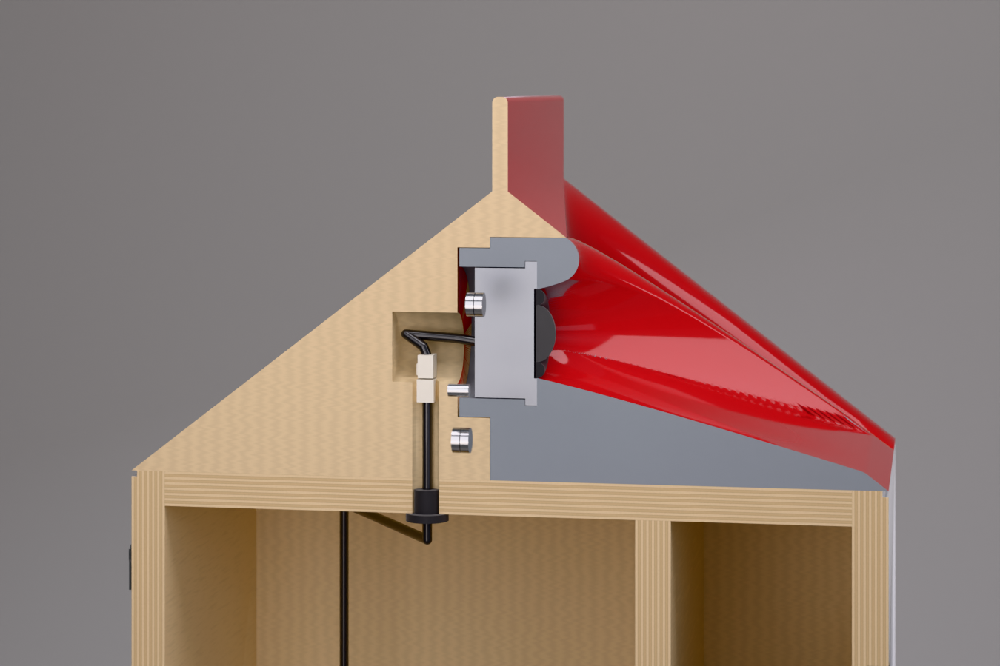
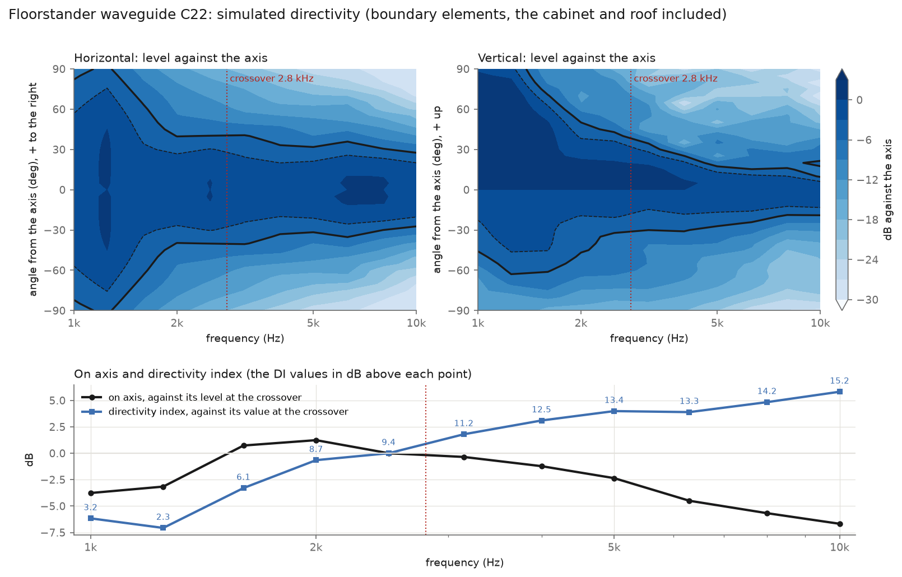
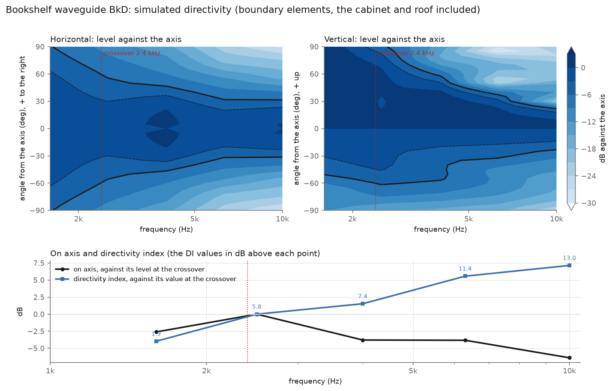

# Fabrication

Everything needed to have earmilk made, in two sizes, from one file of numbers (`params.py`): the **floorstander**, a
three-way, and the **bookshelf**, its two-way little sibling. Both are active: a Hypex FusionAmp plate amplifier in
the back drives each driver from its own channel, and its DSP is the crossover. Change a number, run `build.sh`, and
every cut file, model, drawing, chart and the renders' model follow. `fab/out/` holds the floorstander,
`fab/out-bookshelf/` the bookshelf.

The outside is the spec (`spec/geometry.md`; the bookshelf is the same carton at 0.564 scale with its own plinth and
type sizes). What is inside, and how it goes together, is this folder's **proposal**, marked `PROPOSAL` in `params.py`;
the bought parts' sizes are the research's, marked `PLACEHOLDER` until the parts are in hand.

## The two speakers

| | Floorstander | Bookshelf |
|---|---|---|
| Size | 390 x 390 mm, 1,055 tall | 220 x 220 mm, 594 tall |
| Ways | three, active | two, active |
| Woofer | Dayton Audio RSS315HF-4, 12 in, in 81 L vented to 32 Hz (port 171 mm): f3 about 28 Hz | SB Acoustics SB17NRX2C35-8, 6.5 in, in 9.2 L sealed: f3 63 Hz, a DSP shelf takes it to 45 Hz |
| Mid | SB Acoustics Satori MR16P-8, 6.5 in, in its own 7.6 L sealed chamber | none |
| Tweeter | SB Acoustics Satori TW29DN-B, its faceplate off, rear-mounted on the waveguide insert | Scan-Speak Illuminator D3004/602200, its 62 mm faceplate on the insert's back |
| Waveguide | C22: throat 176 behind the face, 935 up; holds about +-40 degrees horizontally from 2 to 8 kHz | BkD: throat 95 behind the face, 517 up; about +-56 degrees at 2.5 kHz, +-32 from 6.3 kHz |
| Amplifier | Hypex FusionAmp FA253: 250 + 250 + 100 W into 4 ohm, DSP, on its side across the back's foot | Hypex FusionAmp FA122: 2 x 125 W into 4 ohm, DSP, upright on the back |
| Crossovers | 300 Hz and 2.8 kHz, Linkwitz-Riley 24 dB/octave | 2.4 kHz, Linkwitz-Riley 24 dB/octave |
| Wood | 24.9 kg of 18 mm Baltic birch | 6.2 kg |
| Drivers and amplifier, the pair | about $2,520 | about $1,330 |

The figures are simulations and datasheets (below); measure the built speakers before printing the Facts.

## Read this before ordering anything

- **Measure the bought parts first.** Every cutout, rebate and the tweeter's counterbore comes from the research
  (`research/`), which could not open the makers' drawings from this environment: the TW29DN-B's size with its
  faceplate off, the woofers' flanges, the FusionAmps' screw patterns. Buy one of each, measure, edit `params.py`, run
  `build.sh`. The CAD checks its own clearances on every build (`cad.json`, "checks") and stops if a change makes two
  parts collide.
- **The Facts' "8 ohm" and "91 dB" mean nothing on an active speaker.** Its inputs are line level, so impedance and
  sensitivity are not the buyer's business. The bookshelf's Facts already say power and inputs instead; the
  floorstander's should too (an owner's decision).
- **The floorstander's port runs out of air at full power.** At the amplifier's full 250 W near 30 Hz the port's air
  reaches about 50 m/s and will chuff; at a loud 100 dB it is 12 m/s and silent. Set the DSP's high-pass at about
  25 Hz and its limiter to the woofer's excursion.
- **The bookshelf's bass shelf costs excursion.** Its +8.3 dB shelf to 45 Hz needs a 35 Hz high-pass in the DSP.
- **Print the waveguide insert fine and tough.** Its walls are the acoustic surface the simulation was run on: 0.1 mm
  layers or finer, in a tough (ABS-like) SLA resin or MJF nylon, which hold the tweeter's screws in 2 mm walls; filled
  and sanded smooth before the paint. One piece from a service; the floorstander's halves only on a desktop printer.
- **The wordmark is 172 mm wide** at the spec's 44 mm type size (the spec says "about 155"); say if 155 matters and
  the type shrinks to 39.6 mm.

## The build, in order

The two sizes are built the same way; only the numbers differ. Drawings: `out*/drawings/earmilk-sheets.pdf`, eight
A3 sheets per size, numbered EM-FS-001 to 008 (floorstander) and EM-BS-001 to 008 (bookshelf), first-angle: (1) the
general arrangement, (2) the centre section, (3) the waveguide insert and the tweeter's mount and wiring, (4) the back,
the amplifier and the wiring, (5) the exploded view and the parts list, (6) the inner panels' details and the trim
rings' sections, (7) and (8) the notes, all 2.5 mm high: what to measure first (M1, M2, ...) and sheets 1 to 3's notes
by number (1.1, 1.2, ...) on sheet 7; sheets 4 to 6's notes, the glue-up order (G1 to G7) and the fixings (F1, F2) on
sheet 8. Each sheet names the notes sheet its numbers point to.

0. **Buy and measure first.** Buy the drivers, the tweeters and the amplifiers (`bom.csv`) and the ply, and measure
   them before anything is cut or printed. Sheet 7's "Measure first" table lists every value the drawings assume and
   what it sets: the ply's thickness (the sides and inner panels are the plan less twice it); each driver's flange
   (the rebate is the flange + 1.0 of gasket + 3.0 of ring), frame, cut-out, hole circle and surround at its glue line
   (the trim ring's bore is that + 2); the TW29DN-B's front ring and motor (the insert's bore and the sleeve's), or the
   D3004/602200's faceplate, its hole circle and body, and whether its front is flat from ø34 to ø62 with the grille
   off; the dome and surround's diameter (the throat); the amplifier's plate, its corner radius, and its module offered
   to a test cut-out in scrap. Edit `params.py`, run `build.sh`, and check `cad.json`'s "checks" all pass.
1. **Prove the tweeter and its waveguide (a weekend).** Print the gable (`stl/gable-print/`: six pieces for the
   floorstander, four for the bookshelf, each 120 or less on one side for a resin printer's 218 x 123 x 220, keyed by
   ø4 x 20 pins bonded with epoxy) and the insert (`stl/waveguide-insert.stl`) in a tough (ABS-like) SLA resin or MJF
   nylon, not standard resin and not MDF: the sleeve's screws and the bookshelf's knurled inserts need it. One piece from
   a print service is the default, with no seam in the waveguide. The floorstander's also comes in halves for a desktop
   printer (`-left`, `-right`, split at the centre plane and printed tilted, about 209 x 117 x 213), joined by two
   ø3 x 16 steel dowel pins epoxied in ø3.2 holes, the seam filled and sanded flush (sheet 3). Hollow the gable's pieces to 3 mm walls
   with two ø3 drain holes each in the slicer, only in the outer slopes or the end faces, plugged with resin and filled before
   paint: none in the base, a joint face, the cable channel, the bay or the pocket, where a hole would let the woofer's box
   leak round the channel's seal. Bond every joint's full rim and seal the channel halves' seam along its length. The insert
   prints solid in MJF; in SLA solid, or hollow to 4 mm walls with two ø3 drain holes in its base face between the pins
   (sheet 7, the last note on sheet 3). Mount the tweeter on the insert (step 7), set the gable on a box of the
   right plan, and measure on the axis and every 15 degrees horizontally and vertically with a calibrated USB microphone
   and REW. Compare with `out*/acoustics/waveguide/*-polar.png`. If it holds, carry on; the simulation's levers are the
   throat's depth and height (`WAVEGUIDE` in `params.py`, then `bem.py`).
2. **Cut the panels.** `out*/dxf/` to a local CNC cabinet or sign shop or a makerspace ShopBot: front, back, two
   sides, top, bottom, the amplifier box's floor, lid and front; the floorstander adds the window brace and the mid
   chamber's shelf and divider. Each DXF layer names its operation (through cuts, the 3 mm shadow-line and rebate
   pockets, the drivers' and amplifier's rebates, the lid's gland holes and the counterbores for their nuts, cut from
   its underside). The amplifier's cut-out has R3 inside corners: a 6 mm cutter or smaller. No instant online service
   cuts 18 mm plywood.
3. **Glue up the box** (sheet 8, G1 to G7; G1 to G4 on the bookshelf), the front last, so every inner panel slides in
   from the open front. Lay the back face down and glue both sides and the bottom to it; then the amplifier's box, its
   lid's gland nuts epoxied into their counterbores first (20 AF or less), its floor, front and lid between the sides,
   the joints sealed; the floorstander's window brace at z 500; its mid chamber's shelf and divider to marks on the
   sides (the shelf's underside 554 above the bottom panel, the divider's front face 90 behind the sides' front
   edges), the chamber lined with 10 mm felt; the top panel, slid in from the front; and last the front, its M4 T-nuts
   pressed into its inside face first (flanges 15 or less across for the floorstander's woofer, 12 or less for the mid
   and the bookshelf's woofer; barrels 8, 6 and 7 or less). Titebond II or III, a clamp across the sides at every step
   and front to back at the last; check the diagonals. Cut the shadow lines across the front and back panels' edges
   at the side corners and round the four vertical corners (6 mm on the floorstander, 4 on the bookshelf).
4. **Make the gable.** Printed (step 1's pieces), filled and painted, or laminated birch (`dxf/gable-layer-*.dxf`)
   milled to `step/gable-block.step`. The insert's pocket is a prism along the depth and mills from the front with the
   block on its back, but its back wall is 200 deep and the connector bay 250: a 3-axis router needs that much reach
   (a long-series cutter or a 5-axis machine), or print the block. Round the hips and the fin's edges. Before it goes
   on, sand the front panel's top edge flush with the top panel to within 0.1: the insert sits on both. Fix it on four
   10 x 28 mm dowels (holes 10 deep in the top panel, 20 in the block): a birch block with wood glue, a printed one
   with epoxy (3M DP420) on its scuffed base and the dowels, as wood glue does not hold cured resin.
5. **Finish, before anything is fitted.** Fill the grain and edges, 2K high-build primer, block flat, the body colour
   everywhere, mask the marks with the vinyl stencils (`out*/marks/`), the accent colour on the plinth and gable, peel;
   then the Nutrition Facts (`marks/facts-print.pdf`, on the back of the floorstander and the right side of the
   bookshelf) as a screen print in a 2K ink or a water-slide decal, and 2K clear over everything, flatted until the
   print's edge disappears. The insert is painted with the gable but on its face only: mask its sides, base and back,
   its seat, its magnet and pin holes, the pocket's walls and its floor, so the fit (the pocket +0.2/0, the insert
   0/-0.15) survives the paint. The trim rings satin black. Let the clear cure before step 6.
6. **Run the tweeter's cabinet lead** (sheets 3 and 4): round-sheathed 2 x 1.0 mm2, fed down the channel from the
   connector bay through the empty pocket and caught through the woofer's cut-out (it cannot be pushed up from inside),
   through the brace's window (floorstander, 30 mm in from its back edge) to its own gland in the amplifier box's lid.
   Its socket stands on the bay's floor: a Molex Mini-Fit Jr. two-circuit receptacle (39-01-2020, female terminals
   39-00-0077), the lead's end 77 mm above the top panel's underside (40 on the bookshelf), 10 past the floor. Seal the
   channel round the cable with 20 mm of neutral-cure silicone pushed in from the bay.
7. **Mount the tweeter and fit the insert** (sheet 3). Solder the tweeter's own lead to its tabs, 310 mm (220 on the
   bookshelf) of 2 x 0.75 mm2 silicone-insulated flex, twisted, with the connector's plug crimped on its end (39-01-2021,
   male terminals 39-00-0041), pin 1 red +. The
   floorstander's tweeter goes in from behind through its bore, its front ring on a 0.5 mm gasket on the throat's
   seat, held by the printed retaining sleeve (`stl/tweeter-retainer.stl`) and three 3.0 x 12 thread-forming pan
   heads in the boss's back face (one on the horizontal at the speaker's right, the others 120 degrees on). The
   bookshelf's tweeter screws through its faceplate's own holes into three M2.5 knurled inserts bonded in the seat,
   M2.5 x 8 button heads. The magnets in the insert's back and their partners in the pocket's back wall, epoxied,
   opposite poles out; the two pins bonded in; a ribbon loop glued at the back of the groove under the insert's front
   edge, folded back into it between times. Hold the insert just clear of its pocket, reach in and plug its lead into
   the socket in the bay, and slide it home, feeding the spare into the bay as a loop.
8. **The port** (floorstander): the tube is printed 10 mm long. Push it in from the back, dry; slide the flare collar
   on from inside through the woofer's cut-out; fit the woofer and measure the impedance with a DATS V3 (or a sound-card
   impedance jig) clipped to its terminals, its cable not yet connected (that is step 9): the minimum between the two
   peaks is the port's tuning. Take the woofer and collar out, trim the tube's inner end 2 mm at a time until that minimum
   sits at 32 Hz, bond the collar on with epoxy, and glue the flange to the finish.
9. **The glands, the drivers and the amplifier** (sheet 4). Screw the M16 glands' bodies into their nuts in the lid
   from above, one per cable. Inside the amplifier's box cut each of Hypex's harness pairs to about 150 mm and
   butt-splice it to its round cable: only round cable passes the glands. Feed each cable through its own gland and
   tighten it: the woofer's box must be airtight, and the insert's pocket is open to the room through its 0.3 mm seam.
   Hold the runs to the back panel with adhesive cable-tie mounts every 150 mm, and fill the woofer chamber lightly
   (about 150 g of polyester fibre, 60 g in the bookshelf), kept a port's diameter from the port's inner end and off
   the amplifier's box. The drivers on 1.5 mm foam gaskets in their rebates, M4 x 20 low-profile
   button heads (1.6 high and 8 across or less) into the T-nuts, the trim rings over them on three dots of silicone.
   **The amplifier**: its module goes through the back's cut-out into its sealed box, the plate on 3 mm EPDM tape flush
   in its 4.5 mm rebate; drill its holes ø3.5 through the 13.5 left under the rebate, from the plate in hand, and fix it
   with 4.3 x 16 self-tapping pan heads (8 or 10, to suit the plate; Hypex's 4.3 x 25 kit also works).
10. **Metal.** The letters (each size's own `out*/metal/wordmark-letters.dxf`, polished stainless or aluminium,
    1.5 mm for the floorstander and 1.2 mm for the bookshelf; four sets of eight pieces a pair) glued on with epoxy
    from the size's own 1:1 templates (`out*/metal/wordmark-template-*.pdf`).
11. **Tune it** (`out*/dsp/*.md`). Load the channels and crossovers into Hypex Filter Design over USB (a USB mini-B
    cable, not supplied), then measure each driver on the tweeter's axis at 1 m (REW, a UMIK-1), set levels and delays
    from the measurements, check the reverse null at each crossover, and EQ the sum flat on axis. The files' numbers
    are where to start.

## Files and who gets them

| File (in `out/` and `out-bookshelf/`) | What | Goes to |
|---|---|---|
| `step/earmilk-*.step` | the whole speaker, every part in place | anyone, any CAD program |
| `dxf/*.dxf`, `dxf/sheet-*.dxf`, `dxf/sheets.svg` | flat panels, one per file, layers by operation; nested sheets | CNC shop or makerspace |
| `cutlist.csv` | every panel, size and operation for a pair | the shop, and you |
| `step/gable-block.step`, `dxf/gable-layer-*.dxf` | the gable: the milled block and its glue-up layers | CNC millwork or pattern shop |
| `stl/gable-print/` | the gable for printing | a printer |
| `stl/waveguide-insert*.stl`, `step/waveguide-insert.step` | the insert with the waveguide, the tweeter's bore, magnet and pin holes (the floorstander's halves too) | an SLA (tough resin) or MJF service |
| `stl/tweeter-retainer.stl`, `stl/trim-ring-*.stl` | the floorstander's tweeter sleeve; the drivers' trim rings | a print service; a printer (the woofer's ring needs a 320 bed) |
| `stl/port-*.stl`, `step/port-tube.step` | the floorstander's port, two pieces | a printer |
| `drawings/earmilk-sheets.pdf` | the eight A3 sheets, from the same solids | the builder |
| `acoustics/waveguide/` | the waveguide study: candidates, polar maps, the choice | you |
| `dsp/*.md`, `dsp/*.json` | the DSP's starting setup: channels, crossovers, delays, levels, EQ | you, at Hypex Filter Design |
| `acoustics.json`, `acoustics/` | the box: volumes, port, simulated response | you |
| `marks/facts-print.pdf`, `marks/stencil-*.svg` | the Facts at 1:1; vinyl masks for the two marks | a screen printer or decal paper; a sign shop or Cricut |
| `metal/` | the letters and their 1:1 templates | SendCutSend, OSHCut, Xometry |
| `render/` (not in git) | the renders' model, one named part each (`render_model.py`) | the studio engine |
| `../bom.csv` | parts for a pair, both sizes, prices and sources | you |
| `../research/` | the sourcing research behind every bought part | you, before ordering |

## Proposals (not decisions)

None of these changes the outside; each is a choice someone had to make.

- **Joinery:** butt joints, plain 2D cuts any shop can make.
- **The waveguide insert:** the waveguide is a separate printed part in a pocket in the roof, so the waveguide's
  surface can be made finer than milled birch and the tweeter can be serviced: it slides out level, like a drawer,
  held by four magnets and located by two pins, with the tweeter on it and its lead unplugging at a connector in a bay
  behind it.
- **The amplifier's box:** FusionAmps are not airtight, so each module sits in its own sealed box of three 18 mm
  panels behind the plate, its leads out through a gland. In the bookshelf it also does the brace's job.
- **The floorstander's mid chamber:** a shelf and a divider close a 7.6 L sealed box behind the mid.
- **The brace:** one window brace in the floorstander (z 500); none in the bookshelf (above).
- **The drivers flush:** each frame in a rebate as deep as its flange plus a 3 mm printed trim ring over its screws,
  the ring level with the finish.
- **The bookshelf's Facts on its right side,** as on a real carton, because its back holds the amplifier.

## Acoustics

**The woofers.** From the solids, the floorstander's woofer chamber holds 85.1 L of air after the inside panels, the
port and the amplifier's box; less the driver, 81.1 L net. The RSS315HF-4 vented there at 32 Hz simulates to an f3
of 28 Hz at 90.7 dB/2.83 V (Dayton quotes 90.3). The bookshelf's 9.5 L is 9.2 L net: the SB17NRX2C35-8 sealed in it
has fc 73 Hz at Qtc 0.83 and f3 63 Hz, and a Linkwitz transform in the DSP moves the corner to 45 Hz (+8.3 dB).
`acoustics.py`, results in `out*/acoustics.json`.

**The waveguides.** The tweeter's waveguide is shaped for how it spreads sound, not for its looks: a boundary-element
simulation (`bem.py`, bempp-cl) of each candidate in the roof of the whole cabinet, at frequencies from 1 to 10 kHz,
for the horizontal and vertical response and the directivity index (`wg_study.py` compares candidates; `wg_polar.py`
draws the maps). The roof's slope tips the sound upward below about 2 kHz in the floorstander and 3.5 kHz in the
bookshelf; a deeper, higher throat brings control lower, and tipping the axis down did nothing. Each size crosses
where its waveguide's directivity comes nearest the cone below it and the listening axis is within about 1 dB of the
loudest direction: 2.8 kHz in the floorstander, 2.4 kHz in the bookshelf. Details:
`out/acoustics/waveguide/README.md` and `out-bookshelf/acoustics/waveguide/README.md`.

The simulation treats the tweeter as a flat piston across its dome and surround, which beams more than a dome does;
the on-axis fall above the crossover (about 7 dB to 10 kHz in the floorstander) is mostly that, and the DSP's shelf
takes out what the measurement shows. The TW29DN-B's 96.5 dB against the mid's 88 dB leaves 8.5 dB for it.

The insert's CAD is a ruled loft through the wall's meridians. Below the axis the coverage is narrowed so that every
wall meets the roof above the eave, which puts a crease in the wall (at 205 and 335 degrees in the floorstander, 199 and 341 in the bookshelf) and makes
neighbouring walls very different in length where the sides turn into the floor. A meridian lies on each crease and
more are added wherever neighbours differ by over 2 mm (`Waveguide.phis`: 256 in the floorstander, 160 in the
bookshelf); with 96 evenly spaced, the quads between
them twisted into a sawtooth along both creases, small on a print and plain in a gloss coat.

## The crossover (active, a starting point)

`dsp.py` writes each size's starting setup from the geometry and the datasheets (`out*/dsp/`):

| | Floorstander: woofer / mid / tweeter | Bookshelf: woofer / tweeter |
|---|---|---|
| crossovers | 300 Hz, 2.8 kHz, LR4 | 2.4 kHz, LR4 |
| acoustic centre behind the front | 53 / 32 / 172 mm | 32 / 91 mm |
| delay to start | 0.347 / 0.407 / 0 ms | 0.173 / 0 ms |
| gain to start | -2.3 / 0 / -8.5 dB | 0 / -3.5 dB |
| woofer EQ | -3.3 dB at 37 Hz, Q 1.2 (the vented bump) | Linkwitz transform, 73 Hz Q 0.83 to 45 Hz Q 0.71 |

## Rough budget, the pair

Drivers and amplifiers: about $2,520 for the floorstanders ($1,294 of FusionAmps, $1,224 of drivers), about $1,330
for the bookshelves ($844 and $484). The rest (birch, CNC, printing, finish, metal, hardware) from the services
research: about $1,700 doing most of it yourself up to about $9,900 with everything outsourced for the floorstanders;
roughly a third of that for the bookshelves. Add the measurement kit (about $110 for a UMIK-1). `bom.csv` has the
lines.

## Regenerating

The CAD tools need numpy 2 and Blender's `bpy` needs numpy 1, so the CAD tools live in their own environment:

    python3 -m venv .venv-fab && .venv-fab/bin/pip install -r fab/requirements.txt
    fab/build.sh                      # both sizes; SIZES=bookshelf fab/build.sh for one
    EARMILK_SIZE=bookshelf .venv-fab/bin/python fab/cad.py     # any one step, for one size

`build.sh` runs, per size: `cad.py` (solids, STEP, STL, volumes, the clearance checks), `acoustics.py` (the box;
the floorstander's port settles in two passes with the CAD), `dsp.py` (the crossover's starting setup), `flats.py`
(DXF, nesting, cut list), `typeset.py` (letters, the Facts, stencils, templates), `sheets.py` (the drawings) and
`render_model.py` (the engine's model). The waveguide study is separate and slow (minutes per frequency):
`bem.py --throat Y Z --r0 R ...`, then `wg_study.py` and `wg_polar.py`.

## Checks the files pass

Every build checks, on the solids: the insert above the top panel and with material under the tweeter's bore, its
boss and fixings inside its own outline (so it slides into its pocket), 2 mm or more of insert over the bore and 3 of
gable over the pocket's bore, birch over the connector bay, the sleeve's screw heads clear of the bore's floor and its
pilots off the insert's split, the drivers' rebates clear of each other and of the shadow lines, the birch under each rebate 0.5 longer than its T-nuts' barrels, the tweeter's lead long enough to reach its socket with the insert held clear, the insert's pins clear of its magnets, the amplifier's plate
clear of the plinth's shadow line and inside the back, the glands 5 or more apart and inside the lid, the port clear
of the amplifier's box, the box clear of the brace (`cad.json`, "checks"; a failure stops the build).

The floorstander: overall 1,055; ridge 1,010; body 860; slope 246 at 37.6 degrees; fin 45 x 8; plinth 110 with the
groove at 110 to 113 and the gable's at 857 to 860; corners and hips R6, the fin R3; woofer at z 320, mid at 690;
the waveguide's mouth 279 wide, the insert 283; the Facts 266 x 260, top at z 770; port 100 at z 405; the FA253's
plate 360 x 135 at z 185. The bookshelf: overall 594, body 484, plinth 62, R4 and R2, the woofer at z 380, the mouth
156 wide and the insert 159, the Facts 150 x 147 on the right side, the FA122's plate 120 x 315 at z 235. All from
`params.py`, which follows `spec/geometry.md`; where they disagree, the spec wins, with two exceptions the owner's
later decisions made: the build is active, so the Hypex plate takes the back's foot where the spec's passive terminal
cup sat (z 175; `POSTS` and `TERMINAL_CUP` in `params.py` are kept for a passive build), and the tweeter's throat is at
y 176, z 935 from the waveguide study, not the spec's 125. Both are listed for the owner to confirm in the spec.

**Questions for the owner** (the drawing checks', rounds 2 to 5). Open: has Hypex accepted the FA253 lying on its
side, its long edge horizontal, and is a 90 mm sealed box enough for its heat (the research has both open)? Is 1.5 mm
of insert under the bookshelf tweeter's bore strong enough, or should its throat rise 2.2 mm? Is the milled gable meant
for a shop with the reach, or is the printed one the default (the sheets assume either)? If the D3004/602200's body
measures over 49 mm, its faceplate's M2.5 heads no longer clear it and the bookshelf's insert must change. If the
SB17NRX2C35-8's flange is 10.9 rather than 6.5, a flush rebate leaves 3 mm of birch for the T-nuts: a proud ring or a
thicker baffle? If the TW29DN-B's front ring measures over 73.8 mm or its motor over 69, may the boss (ø86), its screw circle (ø79.6) and the pocket's bore grow (the insert's outline leaves about 5.6 mm)? The floorstander's port ends 60 to 70 mm from the woofer's motor, less than its 92 mm bore, with its axis at the motor's top edge: acceptable, or should the port fold or the tube shorten with a larger flare? A printed gable's pocket crosses bonded joints and a 195 mm resin piece can warp more than the pocket's +0.2: give the printed pocket 0.4 a side? Which T-nuts and screws (F1 gives limits: the mid's flange 12 or less, barrel 6 or less, the heads 1.6 high; a 15 mm flange on the mid's circle overhangs its cut-out)? Taken as proposals, for the owner to confirm: the bookshelf insert's outline rises about 3 mm at the
top so it covers the boss behind it (the waveguide is unchanged; its seam on the roof moves about 4 mm up the slope);
the insert is printed in a tough resin or MJF nylon, one piece from a service, the floorstander's halves only as a
fallback; the cabinet's tweeter lead ends at a socket standing on the bay's floor and the tweeter's own flexible lead,
310 mm (220 on the bookshelf), reaches it with the insert held clear of its pocket, its spare looped into the bay; the
bookshelf's bay grows from ø26 to ø32 for the connector; the insert comes out by a ribbon loop against its magnets
that folds back into its groove between times; the bookshelf's letters are 1.2 mm, the floorstander's 1.5; the gable's layers follow the measured ply (one more under 17.73 mm); the tweeter's sleeve is 0.25 longer than its gap, so its screws press the gasket; the insert's unpainted body is the resin's own colour (grey as rendered; a black or white resin would read as finished in an exploded view).
