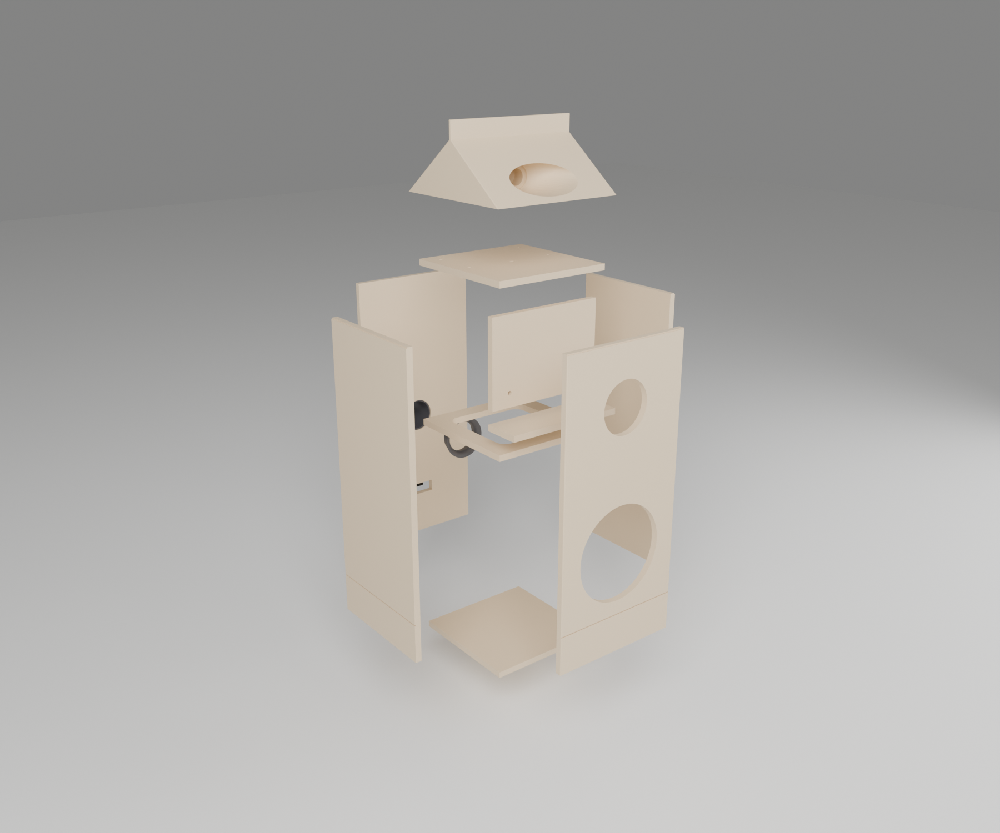
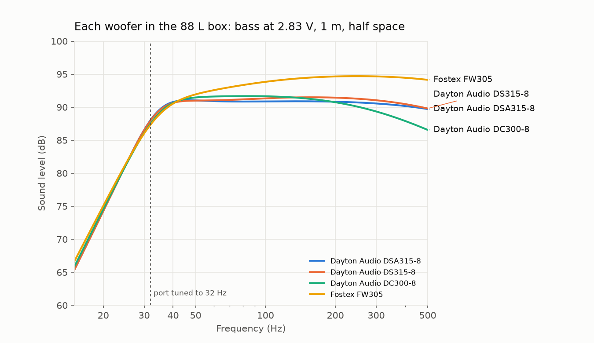
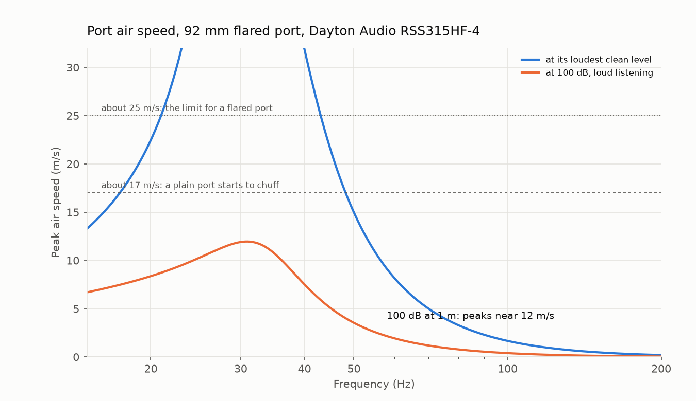
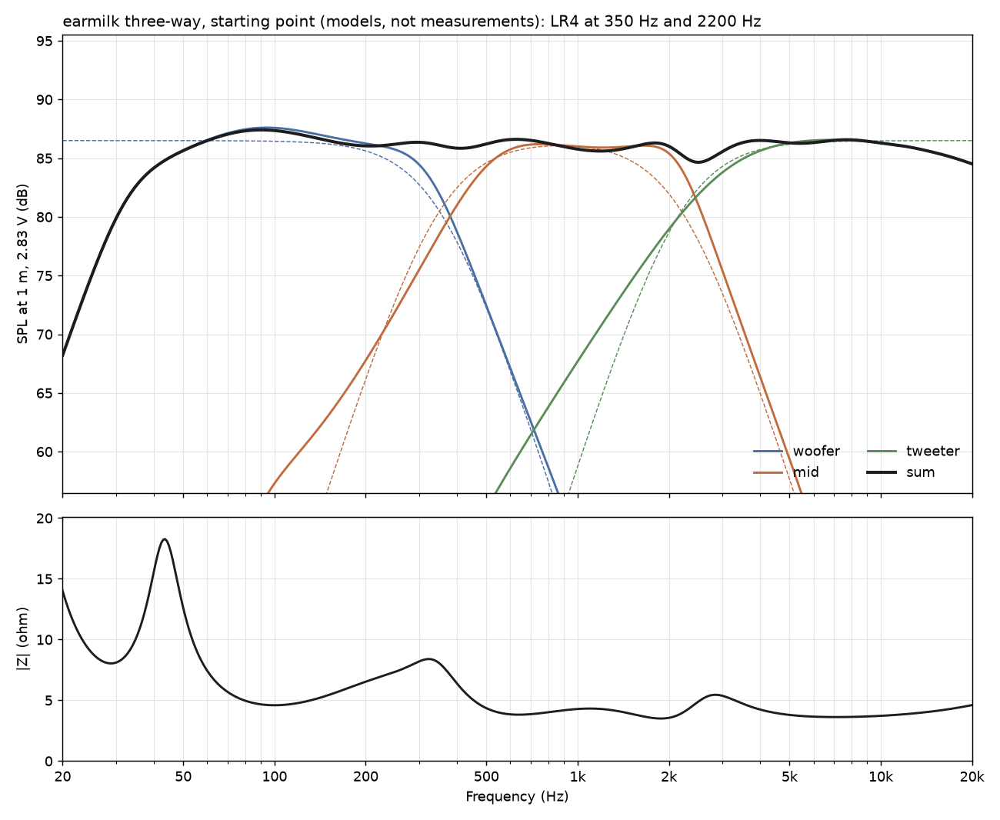

# Fabrication

Everything needed to have a pair of earmilk floorstanders made, generated from one file of numbers (`params.py`) that copies `spec/geometry.md`. Change a number, run `build.sh`, and every cut file, model, drawing and chart follows. Started 2026-10-04.

The outside of the speaker is the spec: every outer dimension, the gable, the bowl, the plinth and its shadow line, the letters, the printed Facts, the port and the marks are where `spec/geometry.md` puts them. What is inside, and how it is put together, is this folder's **proposal**: the owner can change any of it without changing how the speaker looks. Proposals are listed below and marked `PROPOSAL` in `params.py`.

## Read this before ordering anything

- **The Facts say 91 dB, and the speaker probably won't measure it.** A 12 in woofer that reaches 32 Hz in this 88 L box is rated about 90 dB, and with its crossover set flat on a 390 mm baffle the finished speaker lands near 85 to 88 dB. The Facts are permanent once they are under the clear (printed since 2026-10-07; a bronze plate before), so print them after the speaker is measured, or decide now to state a target. The same goes for "8 ohm": every tweeter small enough for the bowl is 4 ohm, so the finished impedance may make "6 ohm" the honest label.
- **The bowl is still an open test.** The README says so: one carved gable, one tweeter, measured against a flat baffle. That costs a print and one tweeter, so it comes first (step 1).
- **Driver cutouts and the tweeter pocket are cut for the shortlisted drivers** (below). Buy different drivers and the holes change: edit three numbers in `params.py` and run `build.sh`.
- **The wordmark is 172 mm wide.** At the spec's 44 mm type size Archivo Black sets 172 mm, which is also what the renders show; `spec/geometry.md` says "about 155". The files follow the type size. Say if 155 is the width that matters and the type should shrink to about 39.6 mm.

## The build, in order

1. **Prove the bowl (a weekend, about $60 to $240).** Print `out/stl/gable-test-slice.stl` (250 x 240 x 150, fits a 256 mm printer; or the `-lower` and `-upper` pair, which print without supports). Buy one shortlisted tweeter and set it in the pocket. Measure it on axis and every 15 degrees off with a calibrated USB mic and REW, then the same tweeter on a flat board. If the bowl does what the README hopes, carry on; if not, the bowl's depth and mouth are the levers (deeper is narrower, wider is wider).
2. **Choose and buy the drivers.** The shortlist is below. Confirm each datasheet's cutout against `params.py` before any wood is cut.
3. **Cut the cabinet panels.** Send `out/dxf/front-baffle.dxf`, `back-panel.dxf`, `side.dxf` (two per speaker), `top-panel.dxf`, `bottom-panel.dxf`, `window-brace.dxf`, `mid-shelf.dxf` and `mid-divider.dxf` to a local CNC cabinet or sign shop, or cut them on a makerspace ShopBot. Each layer in the DXF names its operation. No instant online service cuts 18 mm plywood. Three 5 x 5 ft sheets of 18 mm Baltic birch cover both speakers including the gable glue-ups (`out/dxf/sheets.svg`).
4. **Glue up the box.** Front and back run the full 390 width; the sides sit between them; top, bottom, brace, shelf and divider sit inside. Glue (Titebond II or III), clamp, square it. Then cut the shadow line across the front and back panels' edges at the two side corners (the CNC cut it on each panel's face), with a router and a 3 mm bit or a fine saw at 110 mm. *2026-10-07:* the same for the second shadow line, a 3 × 3 rebate along the top of every wall (z 857 to 860) that the gable will overhang; then round the four vertical corners with a 3 mm roundover bit (the owner: the edges rounded 3 mm).
5. **Make the gables.** Either:
   - **Birch, as the spec says:** glue up 11 layers of 18 mm birch (`out/dxf/gable-layer-01.dxf` to `-11`, rough blanks) into two blocks, 3 layers and 8, and have a CNC shop mill each from its open side (`out/step/gable-block-lower.step`, `-upper.step`). The split at z 914 is chosen so neither half has an undercut worth the name.
   - **Printed, the cheap route:** `out/stl/gable-print/` holds four pieces that fit a 256 mm printer, with 3 mm pin holes on the faces that mate. Glue, fill and paint. Painted, it looks the same; it is lighter and less inert than birch, so it is the owner's call.
   Glue the gable to the box on four 10 mm dowels. *2026-10-07:* round the gable's four hips 3 mm and the fin's top and end edges 1.5 mm (a roundover bit, or a sanding block on the printed route); the CAD and the STEP files carry these rounds.
6. **Print the port** (`out/stl/port-tube-with-flange.stl` and `port-flare-collar.stl`, PETG or ASA). Push the tube in from outside; glue the collar on its inner end through the woofer hole. Print it 10 mm long, measure the impedance, trim until the dip sits at 32 Hz.
7. **Finish.** Fill the grain and edges, 2K high-build primer, block-sand flat, then colour: the body colour first everywhere, then mask the marks with the vinyl stencils (`out/marks/`; OPEN OTHER SIDE on the fin's back face since 2026-10-07), then the accent colour on the plinth and gable, peel. *2026-10-07:* then print the Nutrition Facts on the back (`out/marks/facts-print.pdf`, 1:1, centred, its top border at z 770, 90 mm below the body's top edge): a screen print in a catalysed (2K) ink, or for a one-off a water-slide decal (laser decal paper, clear, on the white flavours; Chocolate's cream ink needs a screen, since a printer cannot lay a light ink on clear film). Let it cure, mist the first coats of clear on lightly so a decal does not wrinkle, then 2K clear over everything and flat it level between coats until the print's edge disappears, the way a guitar's headstock logo is sealed: a scratch has to cut through the clear to reach the ink. Test ink and clear together on a sprayed card first. RAL 9016 or 9003 for the white, RAL 3028 for Whole's red; approve a sprayed card, never the screen. An auto-body shop does the same for about $800 to $2,500 the pair.
8. **Metal.** Letters: `out/metal/wordmark-letters.dxf`, 3.18 mm (0.125 in) sheet, four sets, eight pieces each (the i's dot is its own). The renders show them silver, so stainless or aluminium, polished; brass if warmer is wanted. *2026-10-06: on Chocolate's and Skim's plinths the front letters are dark bronze (bronze or brass darkened with a patina, or a dark PVD on stainless); the back letters stay polished.* The scoop's lip (2026-10-06) is withdrawn (2026-10-07, the owner): no metal at the scoop. Ease the mouth's cut edge to about 1.5 mm by hand before the primer, and paint the tweeter's faceplate ring black if it is bright. The dot is smaller than SendCutSend's minimum part, so cut it at OSHCut or Xometry or by hand. No plate since 2026-10-07: the Facts are printed under the clear (step 7). Terminal plate: `out/metal/terminal-plate.dxf` with the letters order.
9. **Mount the letters** with the 1:1 templates (`out/metal/wordmark-template-front.pdf` aligns to the floor line; `-back.pdf` to the body's top edge). Letters this thin are glued on in the trade; the crosses are where pins go if you want them.
10. **Crossover.** Measure each driver in the finished cabinet (impedance with a Dayton DATS V3; response with the mic), optionally audition with a miniDSP 2x4 HD and three amp channels, then design the passive network in free VituixCAD or XSim and post the files on the Parts Express Tech Talk forum or diyAudio for a second pair of eyes. No published crossover fits, because the bowl is unique.

## Files and who gets them

| File | What | Goes to |
|---|---|---|
| `out/step/earmilk-floorstander.step` | the whole speaker, every part in place | anyone who wants to look, any CAD program |
| `out/dxf/*.dxf` | flat panels, one per file, layers named by operation; `sheet-1..3` nested | CNC router shop or makerspace |
| `out/cutlist.csv` | every part, size and operation for a pair | the shop, and you |
| `out/step/gable-block-*.step` | the gable, whole and split for 3-axis | CNC millwork or pattern shop |
| `out/stl/gable-print/*.stl` | the gable in four printable pieces | a printer |
| `out/stl/gable-test-slice*.stl` | the bowl test piece | a printer |
| `out/stl/port-*.stl` | the port, two pieces | a printer |
| `out/metal/wordmark-letters.dxf/.svg/.step` | the cast-letter wordmark | SendCutSend, OSHCut, Xometry, or a casting service (STEP) |
| `out/marks/facts-print.svg/.pdf` | the Nutrition Facts, 1:1, black = ink, with crop and centre marks | a screen printer, or your laser printer and decal paper |
| `out/metal/terminal-plate.dxf` | the binding-post plate | SendCutSend or OSHCut |
| `out/metal/wordmark-template-*.pdf` | 1:1 placing templates | your printer, at 100 % |
| `out/marks/stencil-*.svg` | vinyl masks for the two marks | a sign shop or a Cricut |
| `out/drawings/earmilk-shop-drawings.pdf` | dimensioned general arrangement and gable detail | the woodworker |
| `bom.csv` | parts, quantities for a pair, rough prices, where | you |
| `research/drivers.md`, `research/services.md` | the sourcing research behind the shortlist and the parts list, every figure with its link | you, before ordering |

## Proposals (not Decisions)

None of these changes the outside. Each is a choice someone had to make; change any in `params.py`.

- **Joinery:** butt joints, all panels plain 2D cuts so any shop can make them. Mitred vertical corners would hide the plywood edges under the paint better and let the groove be cut on each panel before assembly; they need a 45 degree saw or a V-bit.
- **Shadow line:** a 3 x 3 mm groove at z 110 to 113 in all four walls; *2026-10-07:* and a 3 x 3 rebate at z 857 to 860 along the top of every wall, under the gable.
- **Mid chamber:** a shelf (z 572 to 590) and a divider (y 108 to 126) close an 8.0 L sealed box behind the mid, using the walls and the top. Every shortlisted mid sits happily in it (sealed resonance 71 to 83 Hz, far below a 350 Hz crossover).
- **Brace:** one window brace at z 500, a 254 mm square opening.
- **Gable:** laminated from 18 mm layers and split at z 914 for 3-axis milling; or printed in four pieces.
- **Tweeter pocket:** a 64 x 6 counterbore for the 62 mm faceplate and a 45 x 34 bore for a 43 mm body, which leaves a 9.5 mm shoulder for the faceplate screws; a 14 mm wire hole drops into the woofer chamber. Seal it after wiring, or the woofer box leaks through the bowl.
- **Port:** printed, two pieces, 92 bore, 100 OD (the spec's port), 112 flange outside, flared inside.
- **Back terminal cutout:** 96 x 36 behind the 128 x 64 plate, with four screws at (±56, ±25).

## Acoustics

From the solids: the woofer chamber holds **91.6 L** of air after the internal panels and the port; less the woofer's own displacement, **88.1 L net**, inside the 85 to 90 L the README assumes. The cabinet's wood weighs **27 kg** (7.2 kg of it the gable), so with drivers and crossover the README's 36 kg is about right.

The simulation is the standard vented-box model fed with each driver's published parameters (`acoustics.py`). It predicts the Dayton DSA315-8 at 90.8 dB where Dayton quotes 90.3, so it is in the right place.

| Woofer | Box | f3 | Level at 2.83 V, half space | Loudest clean, 40 Hz / 30 Hz | Note |
|---|---|---|---|---|---|
| Dayton DSA315-8 | 88.1 L, 32 Hz | **31.7 Hz** | 90.8 dB | 110 / 106 dB | the shortlisted woofer |
| Dayton DS315-8 | same | 32.8 Hz | 91.4 dB | 110 / 106 dB | non-metal cone |
| Dayton DC300-8 | same | 32.5 Hz | 90.6 dB | 108 / 104 dB | budget, less excursion |
| Fostex FW305 | same | 47.5 Hz | 94.7 dB | 109 / 106 dB | the price of sensitivity: no deep bass |

**The port** for the DSA315-8 is 152 mm overall for 32 Hz (the printed tube 134 mm plus the 18 mm collar). Its air peaks near 27 m/s only at the woofer's full rated power around 30 Hz; at a loud 100 dB it peaks near 8 m/s, well clear of the 17 to 25 m/s where ports start to chuff.

**What the label can honestly say:** 32 Hz is real. 91 dB is the woofer's own rating; the finished speaker, voiced flat, will measure lower. Decide the Facts after measuring (see the top of this page).

## Crossover (a starting point from models)

`crossover.py` joins the mid set (DSA315-8, SB17MFC35-8, R3004/602200) with a textbook three-way network (third-order
low-pass on the woofer, a band-pass and L-pad on the mid, a third-order high-pass and L-pad on the tweeter) and fits
its 14 parts to Linkwitz-Riley targets at the label's 350 Hz and 2.2 kHz with `studio/xover/xover.py`. The drivers
are lumped models from their datasheets in their boxes (88.1 L at 32 Hz, 7.6 L sealed, the bowl), placed where the
spec puts them, with delays to a seated listener at 2.5 m. Results in `out/xover/`: `response.png`, `parts.csv`,
`design.json`.

- In the model the sum holds within about 2 dB from 150 Hz to 16 kHz and the impedance bottoms at 3.7 ohm: a 4 ohm
  speaker, not the label's 8.
- The bowl puts the tweeter 170 mm behind the front face, so it reaches the listener 0.37 ms after the mid. The fit
  absorbs it with the mid in positive polarity; measured drivers will move it.
- The woofer's first inductor is large (about 5 mH): wind it in 14 AWG air core, or use a laminated steel core for
  lower resistance and size.
- **Replace with measurements before buying parts.** Measure each driver in its finished box (gated FRD on the
  listening axis, ZMA), put the files in the design as `"frd"` and `"zma"`, and run
  `.venv-fab/bin/python studio/xover/xover.py fab/out/xover/design.json --optimize`.

## Driver shortlist (a proposal for the README's open question)

| Set | Woofer | Mid | Tweeter | Drivers per speaker |
|---|---|---|---|---|
| Budget | Dayton DSA315-8 | SB Acoustics SB17MFC35-8 | Peerless OC25SC65-04 in a printed ring | about $251 |
| Mid | Dayton DSA315-8 | SB Acoustics SB17MFC35-8 | Scan-Speak Illuminator R3004/602200 | about $413 |
| Premium | Dayton DSA315-8 (or DS315-8) | SB Acoustics Satori MR16P-8 | Scan-Speak Illuminator R3004/602200 | about $544 |

The tweeter is the hard constraint: almost every compact 1 in dome has a 65 to 72 mm faceplate, and the throat is 66. The Scan-Speak Illuminators have 62 mm round faceplates as sold and resonate low enough (420 Hz) for the spec's 2.2 kHz crossover; the cheap faceplate-less elements need a printed ring and a crossover nearer 3 kHz. Every figure is in `drivers.json` with its source; they were gathered by web search on 2026-10-04 without opening the pages, so confirm each datasheet before buying.

## Rough budget for the pair

From the services research (all estimates, drivers and electronics excluded): about **$1,700** doing most of it yourself (makerspace CNC, printed gables, DIY paint), **$3,500 to $4,000** in the middle (CNC shop panels, printed gables, a body shop), about **$9,900** with everything outsourced (milled birch gables, body-shop paint, polished letters). Add the drivers ($500 to $1,100 the pair), the crossover parts ($200 to $500) and the measurement kit (about $250).

## Regenerating

The CAD tools need numpy 2 and Blender's `bpy` needs numpy 1, so the CAD tools live in their own virtual environment:

    python3 -m venv .venv-fab && .venv-fab/bin/pip install -r fab/requirements.txt
    FAB_PY=.venv-fab/bin/python fab/build.sh

`build.sh` runs `cad.py` (solids, STEP, STL, volumes), `acoustics.py` (port length, simulation, charts; it and the CAD settle the port in two passes), `crossover.py` (a starting network from driver models), `flats.py` (DXF, nesting, cut list), `typeset.py` (letters, plate, stencils, templates; fonts from `render/fonts`), `drawings.py` (shop drawings), then `render_views.py` with the system Python and `bpy` (exploded and section views).

## Checks the files pass

Overall 1,055; ridge 1,010; body 860; slope 246 at 37.6°; fin 45 x 8; mouth 211 x 118 centred 79 up the slope; throat ø66 at y 170, z 903.5; woofer at z 290, mid at 690; plinth 110 with the groove at 110 to 113; plate 318 x 312 at z 484 to 796, 1.5 proud; port ø100 at z 405; post plate 128 x 64 at z 150; letters 44 mm centred on z 55 (front) and z 826 (back), ink centred on x 195. All read from `params.py`, which reads from `spec/geometry.md`; if they disagree, the spec wins and `params.py` is wrong.
