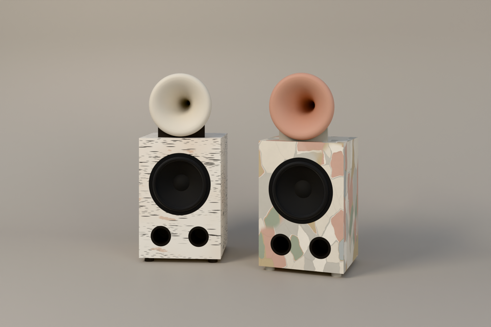

# barkhorn (a working name): a hybrid horn loudspeaker in bark

The owner's idea of 2026-10-10: speakers that look like Friendly Pressure's horns, in two finishes, birch bark and
eucalyptus bark, each with a horn in its bark's colours.

Status: **concept**. The owner pointed to a photograph (resistormag.com, Friendly Pressure, 2023), but this environment
cannot fetch that site. Everything here is drawn from written descriptions of Friendly Pressure's work:

- modular hybrids, part horn, part cabinet, part sculpture;
- a big paper-cone bass box with a round horn on top, after the vintage Altec, JBL and Tannoy monitors;
- finished in wood or paint.

The layout, the proportions and the horn's shape are proposals to match to the photograph once it can be seen.

## What it is

- **The bass cabinet.** It holds a 15 in paper-cone woofer (FaitalPRO 15PR400-8, 99 dB) and two front ports, and is
  520 wide, 460 deep and 760 tall on four turned feet. It is 18 mm birch plywood faced in bark.
- **The horn.** A round tractrix horn sits on top. It has a 1 in throat and a 341 mm mouth that holds the pattern to
  about 320 Hz, and is 391 long, with a 12 mm wall and a lip rolled back on 25 mm. It rests in two felt-lined saddles,
  strapped down. It is turned from laminated birch rings and painted. Art of Sound's solid-beech Le Cléac'h horn
  (EUR 1,200 a pair) is the bought alternative.
- **The compression driver.** A BMS 4550-16 sits at the throat. It has a polyester diaphragm, gives 113 dB, and is
  crossed at 800 Hz or above. The research's case for it: a non-metal diaphragm crossed low on a big round horn is how
  a horn avoids the bright, tiring top end horns are blamed for.
- **The amplifier.** A Hypex FusionAmp FA122 on the back does the crossover (LR4 at about 800 Hz) and the EQ. A passive
  L-pad takes the HF channel down about 10 dB, so the amplifier's hiss stays inaudible through the 113 dB driver.
- **The bass.** About 138 L net, tuned to 38 Hz with two 100 mm ports 161 long. f3 is about 47 Hz in half space before
  room gain (`speaker/box.py`: `.venv-fab/bin/python spinoffs/barkhorn/product.py`). At full output, the ports' air
  reaches about 30 m/s, which is loud enough to chuff. Larger ports, or a slot, are a *proposal* if it plays loud.

## The two finishes (proposals)

| | cabinet | horn, outside | horn, the bell | saddles and feet |
|---|---|---|---|---|
| birch | paper birch: chalk white, dark lenticels in bands, a few scars, apricot where it has peeled | chalk `#E9E3D7` | a shade deeper, `#DAD2C3` | charcoal `#2B2724`, the lenticels' colour |
| eucalyptus | a smooth-barked gum: patches of cream, grey, salmon, ochre and sage | sage `#97A38B` | salmon `#C99B86` | warm grey `#B9B3A5` |

- **In the renders**, both barks are procedural materials (`birch_bark` and `eucalyptus_bark` in
  `studio/engine/materials.py`). The CC0 bark scans on Poly Haven and ambientCG are blocked here. Allowing those hosts
  would let the renders use photographed bark.
- **The real finish.**
  - Birch: real bark sheet (*Betula papyrifera*, from fallen or felled trees) laminated to the plywood with PVA in a
    vacuum bag and sealed with a matt waterborne lacquer.
  - Eucalyptus: the shed bark of a smooth-barked gum, pressed flat and laminated the same way, or a UV-printed veneer
    of it.

  Approve a sample board first.
- **The other horn I considered** for birch was a charcoal bell, so the horn reads as the lenticels' black. Seen from
  the front, the bell is most of the horn: a dark bell reads as a black horn.

## The fabrication package

Built with the fab kit (`studio/fabkit`):

    .venv-fab/bin/python studio/fabkit/build.py spinoffs/barkhorn/product.py

It writes `out/`:

- STEP and STL;
- the panels' DXF cut files, nested on three 1525 mm sheets;
- the checks (no clashes);
- the parts list with budgets (bom.md);
- 11 A3 drawing sheets;
- the render model.

The shots are in `studio/shots/barkhorn/`: `birch`, `eucalyptus` and `pair`.

## Open questions for the owner

1. **The photograph.** Attach it, or allow resistormag.com in the environment's network settings. Then the layout,
   the horn and the proportions can be matched to it.
2. **The horn colours above.** Keep them, or swap them: a charcoal bell for birch, and for eucalyptus, a salmon
   outside with a sage bell.
3. **A name.** barkhorn is a placeholder.
4. **Price.** [PAIR PRICE] stays open.
