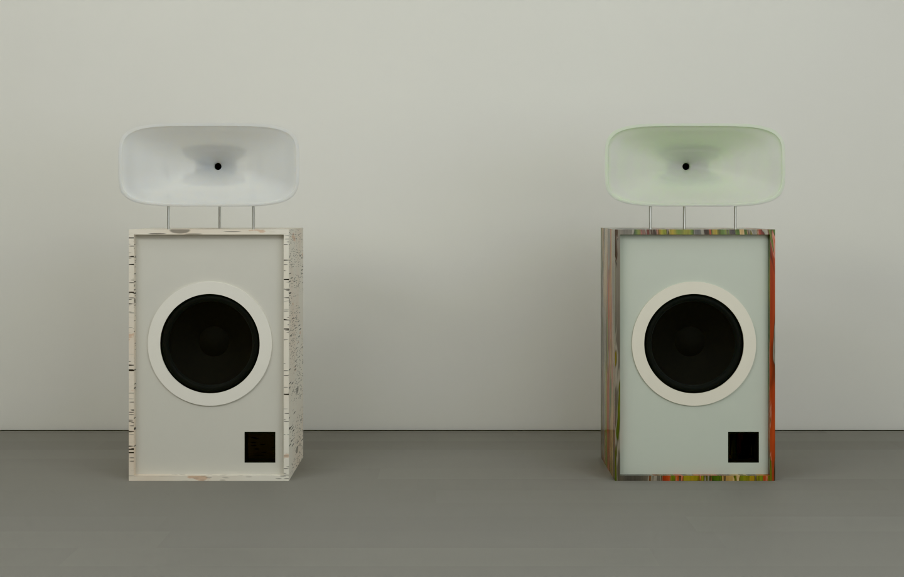
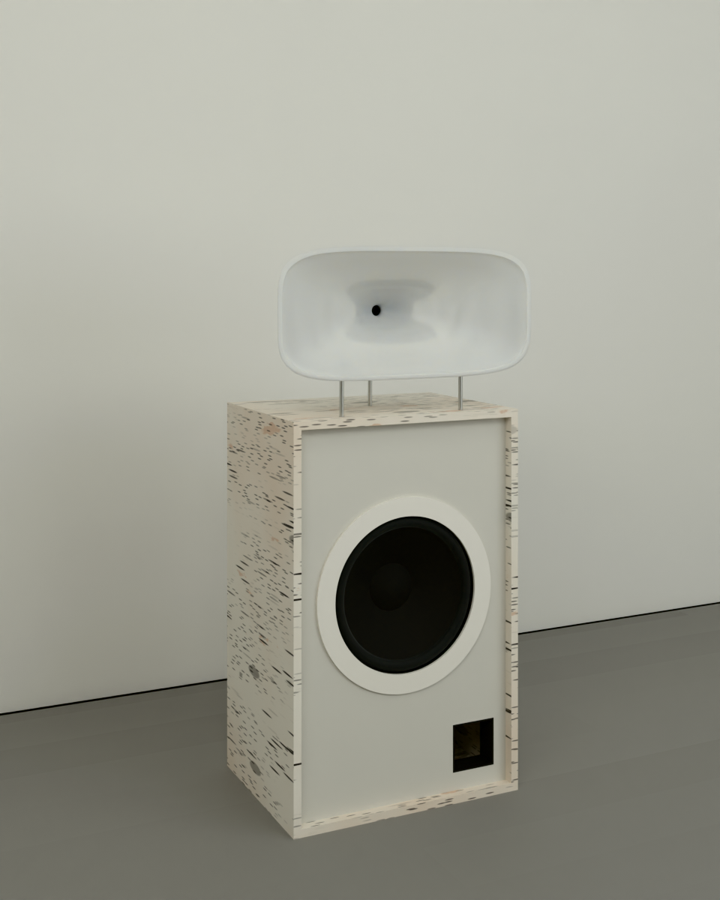
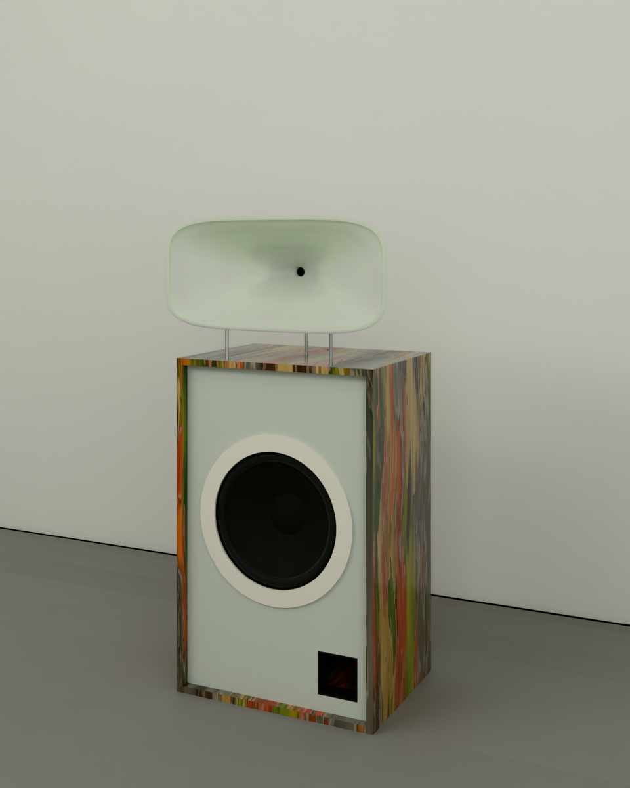
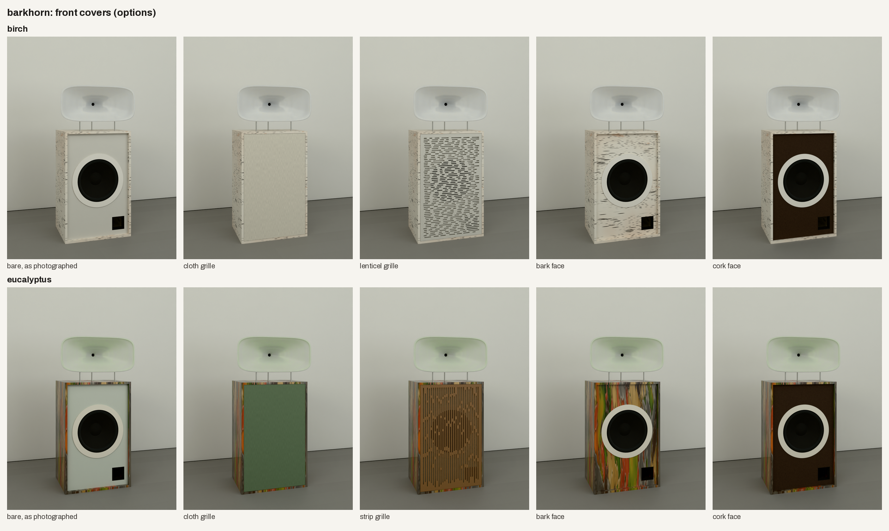
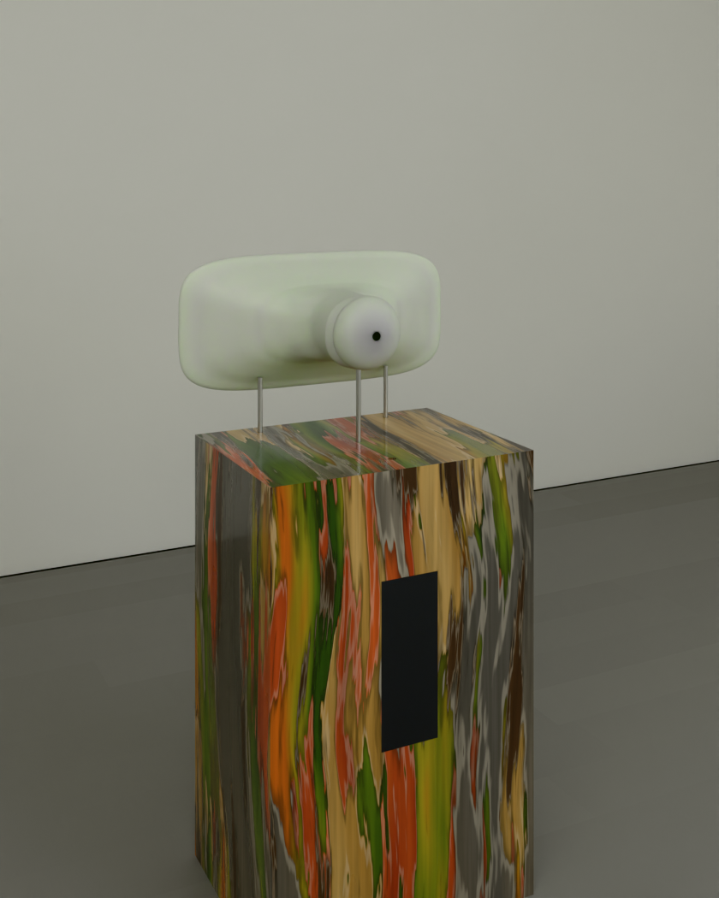

# barkhorn (a working name): Friendly Pressure's horn speaker, in bark

The owner's idea of 2026-10-10 was speakers that look like their reference photograph of Friendly Pressure's horns
(`reference/friendly-pressure-owner-2026-10-10.jpg`, with two more of the same speakers in a bar and a studio beside
it). There are two finishes, birch bark and eucalyptus bark, each with a horn in its bark's colours.

Status: **concept, round 2**. The proportions follow the photograph. The sizes are scaled from its turntable (about
450 wide).

## Round 2: the owner's notes of 2026-10-10

| the note | what changed |
|---|---|
| "It's interesting that you made the waveguides so thick. I kind of like that less of the innards are exposed that way potentially, but it does make it look less sleek and more pudgy." | The waveguide is now a **thin cast shell**. It is 6 mm thick and follows the flare outside as well as in, with a 10 mm rim at the mouth. Behind the throat, a round **pod** 148 across closes round the compression driver, and a cap closes the pod. Nothing inside shows, and the horn reads as one sheet bent into shape (`../../renders/2026-10-10/barkhorn/back-v3.png`). It uses about 1.5 L of resin. It stands on three rods (two under the mouth, one under the pod), each cut to meet the shell's underside. |
| "The eucalyptus looks too pastel and not like the long strips of peely camo-ish bark. Like a eucalyptus after rain." | The bark is redrawn as a smooth-barked gum sheds it, in **layers**. The fresh underbark is streaked deep green, olive, yellow and orange. Over it lie older layers in long vertical strips: straw, rust, grey, then brown. Each strip's edge lifts, with a dark shadow under it and a lit, curled lip. Everything is **wet**: deeper and more saturated, glossy, with rain-darkened runs (`../../renders/2026-10-10/barkhorn/eucalyptus-detail-v3.png`). |
| "Open to ideas on front panel covers" | **Five covers**, each built in the CAD with its own cut files and parts list, and rendered on both barks (below). |

## What the photograph shows, and how it is built here

| in the photograph | here |
|---|---|
| a bass cabinet about 1 : 1.6 | 560 wide, 880 tall, 420 deep, standing on felt glides |
| a thin walnut shell framing a pale front panel set back in it | The shell (sides, top, bottom, back) is 18 mm birch plywood faced in **bark**, wrapped round its front edges. The front panel is set back 24 mm and painted pale. 24 mm is deep enough for a cover to clear the cone. |
| a 15 in black cone in a wide off-white ring, its centre a little above the middle | FaitalPRO 15PR400-8 (treated paper cone, 99 dB), flush in its rebate, its centre 45.7 % down. A 6 mm MDF ring 436 across lies over its frame, with pockets behind for the screw heads. |
| a small square port at the bottom right | A 100 mm square printed port, bottom right, 53 long. The box is about 152 L net, tuned to 38 Hz; f3 is about 44 Hz in half space before room gain (`.venv-fab/bin/python spinoffs/barkhorn/product.py`). |
| a frosted, translucent rounded-rectangle waveguide, wider than the cabinet, the throat a dark dot at its centre | The waveguide's mouth is 612 x 272, filling its face (633 x 292 overall). Its flare is 170 deep, with the pod 70 behind it. It is a superellipse waveguide: round at the 1 in throat, squaring toward the mouth, covering about 120 x 75 degrees. It is cast in tinted translucent polyurethane and bead-blasted to frost. |
| it floats on thin rods | three 10 mm stainless rods, about 80 clear between the cabinet and the mouth's rim, M8 into inserts in the top and pads cast inside the shell |
| (not visible) | A BMS 4550-16 compression driver (polyester diaphragm, 113 dB) sits in the pod. A Hypex FusionAmp FA122 on the cabinet's back crosses at about 800 Hz and pads the HF channel about 14 dB. Part of the pad is a passive L-pad after the amplifier, so its hiss stays inaudible. |

## The two finishes (proposals)

| | shell | front panel | ring | waveguide |
|---|---|---|---|---|
| birch | paper birch: chalk white, dark lenticels in bands, a few scars, apricot where it has peeled | pale warm grey `#D8D5CD`, as photographed | off-white `#EEEAE2` | milk-white frosted resin `#F5F2EC`, warming to `#EFE5D3` where it is thick, as sap |
| eucalyptus | a smooth-barked gum after rain: underbark streaked green, olive, yellow and orange under strips of straw, rust, grey and brown, wet | pale sage grey `#CBCFC4` | cream `#E8E2D4` | sage frosted resin `#DEE6D4`, deepening to leaf green `#B9C9A9` |

- **The renders.**
  - Both barks are procedural materials (`birch_bark` and `eucalyptus_bark`).
  - The waveguides use a subsurface-scattering frosted resin (`frosted`), and the covers use `cloth` and `cork`.
  - All of them are in `studio/engine/materials.py`.
  - Photographed CC0 bark (Poly Haven, ambientCG) would need those hosts allowed in the environment's network
    settings.
- **The real finish.**
  - Birch: real bark sheet (*Betula papyrifera*, from fallen or felled trees) laminated with PVA in a vacuum bag and
    sealed matt.
  - Eucalyptus: the shed bark of a smooth-barked gum (a snow or spotted gum) pressed flat and laminated the same way,
    or a UV-printed veneer of it. The wet look is a satin or gloss sealer, which deepens bark's colours as rain does.

  Approve a sample board first.
- **The waveguide** is cast in a two-part silicone mould from a CNC-cut plug, and the cap in a small mould of its own.
  The parts list spreads a mould budget of $900 for the shell and $250 for the cap over the pair. Tinting the resin per
  finish costs nothing more.

## Front covers (options)

Each cover sits in the 24 mm recess, 1.5 clear of the shell all round. A grille stands flush with the shell's front on
four pegs into cups in the panel's corners. Its back stays at least 16 clear of the cone at rest, which leaves 4.5 mm
even at twice the woofer's Xmax. The woofer plays only below 800 Hz, so a slotted grille open about a quarter of its
face costs it nothing audible: the air behind it resonates in the slots near 1.9 kHz, over an octave above the
crossover.

| option | what it is | the look |
|---|---|---|
| bare (as now) | the painted panel, the ring and the cone, as photographed | the reference, unchanged |
| cloth grille | acoustically transparent knit stretched over a 6 mm MDF frame (sprayed black), its face 1 back from the shell's front; oatmeal `#DCD6C8` on birch, eucalyptus-leaf green `#6F7F66` on eucalyptus | calm and flat: the bark and the horn carry it alone |
| lenticel grille (birch's own) | 6 mm birch plywood sprayed the panel's colour, cut with 394 round-ended 6 mm slots in rows of short dashes of random length, as birch's lenticels; 24 % open | the woofer hidden behind the bark's own pattern: dark dashes on pale, as on the shell |
| strip grille (eucalyptus's own) | 6 mm spotted-gum plywood (a eucalypt hardwood face), oiled, cut with 124 long vertical slots in columns, bridged at random heights, as the bark's strips; 28 % open | warm timber under the wet bark: the tree's wood in front, its bark round it |
| bark face | the panel faced in the bark itself (1 mm), cut round the ring and the port | a log with a speaker in it; the boldest |
| cork face | 3 mm cork sheet laid on the panel round the ring and the port; dark, as smoked expanded cork | cork is bark too (the cork oak's): a third bark, dark behind the white ring |

The slot patterns are seeded, so a rebuild cuts the same panel. Their cut files are in `out/dxf/`, nested on sheets of
their own. The covers' materials are budgets only where the kit has a rate: the cloth, the pegs, the bark, the cork
sheet and the spotted-gum plywood show [PRICE] until a supplier's figure is entered. The woofer's roll height is
proportioned (the datasheet gives none). Confirm on a driver that its roll does not stand proud of its flange before a
grille is fitted.

**My picks:** the **lenticel grille on birch** and the **strip grille on eucalyptus**, each cover drawn from its own
tree. Bare stays the reference for both.

## The fabrication package

Built with the fab kit (`studio/fabkit`):

    .venv-fab/bin/python studio/fabkit/build.py spinoffs/barkhorn/product.py
    python3 spinoffs/barkhorn/render_covers.py          # the covers' grid (one frame per bark and cover)

It writes `out/`:

- STEP and STL;
- DXF cut files for the plywood (three 1525 mm sheets), the MDF rings, and each cover on its own sheets;
- the checks (no clashes, covers included);
- the parts list (`bom.md`): about $3,430 for the pair at budget rates, before the few unpriced items, with each cover
  listed after it with its own subtotal;
- 17 A3 drawing sheets (`out/drawings/barkhorn-sheets.pdf`). The assembly sheets show the speaker without covers;
  each cover's cut panel has a sheet of its own, its slots as one pattern;
- the render model.

The shots are in `studio/shots/barkhorn/`:

- `front`: the pair, as photographed;
- `birch` and `eucalyptus`;
- `eucalyptus-detail`: the bark close to;
- `back`: the waveguide from behind;
- `covers/`: one shot per bark and cover.

## Open questions for the owner

1. **The waveguide.** Is the thin shell with its pod the sleek look you meant?
2. **The eucalyptus.** Is this the gum after rain you meant? A photograph of the tree you have in mind would let it be
   matched.
3. **The covers.** Pick per finish, or none. The grilles can also go the other way round (lenticels on eucalyptus,
   strips on birch), and any cover can take another colour.
4. **The colours above.** Keep them or swap. Options include a charcoal front panel on birch, or a salmon or amber
   waveguide on eucalyptus (as Friendly Pressure's amber).
5. **A name.** barkhorn is a placeholder.
6. **Price.** [PAIR PRICE] stays open.
