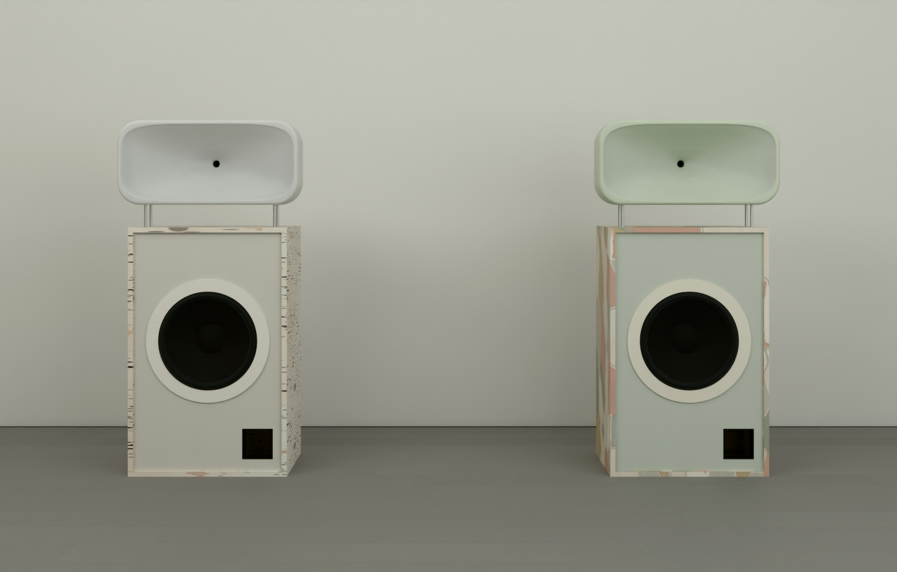

# barkhorn (a working name): Friendly Pressure's horn speaker, in bark

The owner's idea of 2026-10-10: speakers that look like their reference photograph of Friendly Pressure's horns
(`reference/friendly-pressure-owner-2026-10-10.jpg`), in two finishes, birch bark and eucalyptus bark, each with a
horn in its bark's colours.

Status: **concept**. The proportions follow the photograph; the sizes are scaled from its turntable (about 450 wide).

## What the photograph shows, and how it is built here

| in the photograph | here |
|---|---|
| a bass cabinet about 1 : 1.6 | 560 wide, 880 tall, 420 deep, standing on felt glides |
| a thin walnut shell framing a pale front panel set back in it | the shell (sides, top, bottom, back) in 18 mm birch plywood faced in **bark**, wrapped round its front edges; the front panel set back 12 mm, painted pale |
| a 15 in black cone in a wide off-white ring, its centre a little above the middle | FaitalPRO 15PR400-8 (treated paper cone, 99 dB), flush in its rebate, its centre 45.7 % down; a 6 mm MDF ring 436 across over its frame |
| a small square port at the bottom right | a 100 mm square printed port, bottom right, 49 long: about 157 L net tuned to 38 Hz; f3 about 43 Hz in half space before room gain (`.venv-fab/bin/python spinoffs/barkhorn/product.py`) |
| a frosted, translucent rounded-rectangle waveguide, wider than the cabinet, the throat a dark dot at its centre | 640 x 300, 170 deep, its mouth filling the face (612 x 272): a superellipse waveguide (round at the 1 in throat, squaring toward the mouth, about 120 x 75 degrees), cast hollow with 6 mm walls in tinted translucent polyurethane, bead-blasted to frost |
| it floats on thin rods | four 10 mm stainless rods, 80 tall, M8 into inserts in the top and bosses cast inside the waveguide |
| (not visible) | a BMS 4550-16 compression driver (polyester diaphragm, 113 dB) on the waveguide's back; a Hypex FusionAmp FA122 on the cabinet's back crossing at about 800 Hz, the HF channel padded about 14 dB (part of it a passive L-pad after the amplifier, so its hiss stays inaudible) |

## The two finishes (proposals)

| | shell | front panel | ring | waveguide |
|---|---|---|---|---|
| birch | paper birch: chalk white, dark lenticels in bands, a few scars, apricot where it has peeled | pale warm grey `#D8D5CD`, as photographed | off-white `#EEEAE2` | milk-white frosted resin `#F5F2EC`, warming to `#EFE5D3` where it is thick, as sap |
| eucalyptus | a smooth-barked gum: patches of cream, grey, salmon, ochre and sage | pale sage grey `#CBCFC4` | cream `#E8E2D4` | sage frosted resin `#DEE6D4`, deepening to leaf green `#B9C9A9` |

- **The renders.** Both barks are procedural materials (`birch_bark` and `eucalyptus_bark`), and the waveguides use a
  subsurface-scattering frosted resin (`frosted`), all in `studio/engine/materials.py`. Photographed CC0 bark (Poly
  Haven, ambientCG) would need those hosts allowed in the environment's network settings.
- **The real finish.**
  - Birch: real bark sheet (*Betula papyrifera*, from fallen or felled trees) laminated with PVA in a vacuum bag and
    sealed matt.
  - Eucalyptus: shed bark of a smooth-barked gum pressed flat and laminated the same way, or a UV-printed veneer of
    it.

  Approve a sample board first.
- **The waveguide** is cast in a two-part silicone mould from a CNC-cut plug. The parts list spreads a budget of $900
  for the mould over the pair. Tinting the resin per finish costs nothing more.

## The fabrication package

Built with the fab kit (`studio/fabkit`):

    .venv-fab/bin/python studio/fabkit/build.py spinoffs/barkhorn/product.py

It writes `out/`:

- STEP and STL;
- DXF cut files for the plywood (three 1525 mm sheets) and the MDF rings;
- the checks (no clashes);
- the parts list (bom.md): about $3,300 for the pair at budget rates, before the few unpriced items;
- 12 A3 drawing sheets;
- the render model.

The shots are in `studio/shots/barkhorn/`: `front` (the pair, as photographed), `birch` and `eucalyptus`.

## Open questions for the owner

1. **Is this the read of the photograph you want?** In particular, check the proportions, the frame and the rods.
2. **The colours above.** Keep them, or swap: a charcoal front panel on birch (bolder, after its lenticels), or a
   salmon waveguide on eucalyptus.
3. **A name.** barkhorn is a placeholder.
4. **Price.** [PAIR PRICE] stays open.
